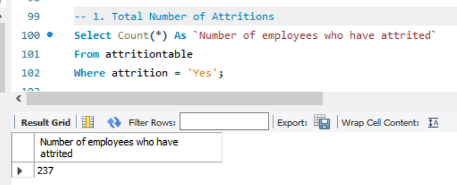
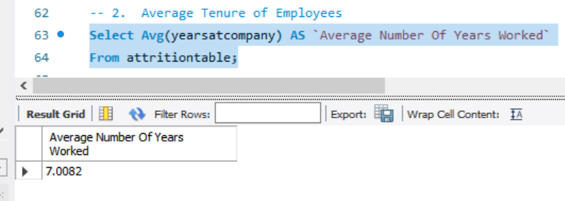
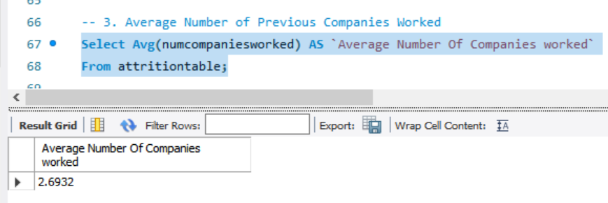
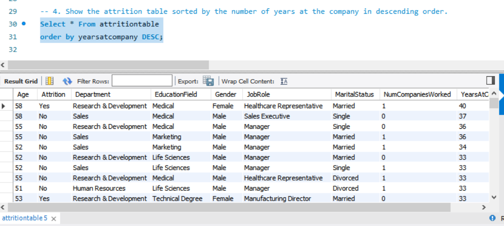
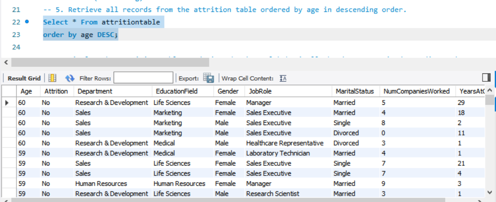
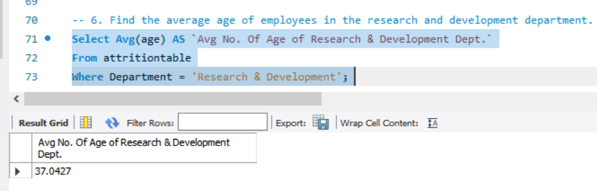
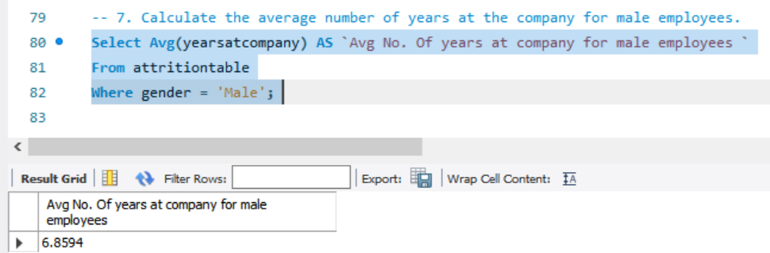
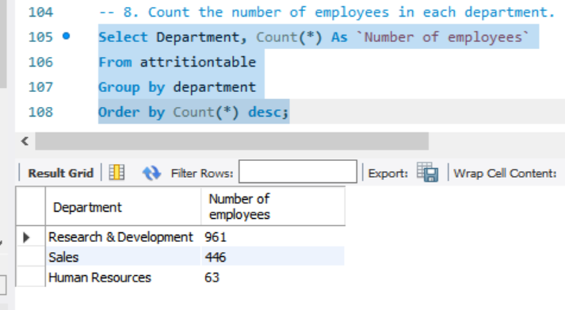
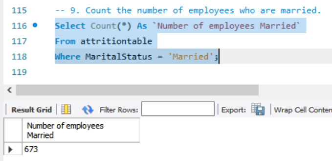
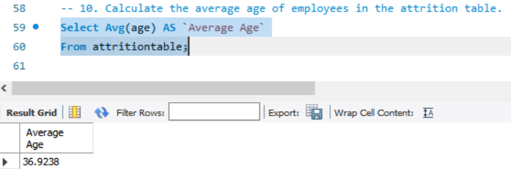

# Workforce Intelligence & Employee Attrition Optimization Analysis

---

## Project Overview

Employee attrition (when employees leave an organization) is a major HR and business challenge because it increases recruitment costs, reduces productivity, and can affect team performance.

This project involves analyzing an employee attrition dataset using SQL queries to extract meaningful insights about workforce demographics, attrition patterns, and employee characteristics.

The analysis covers fundamental SQL operations including sorting (`ORDER BY`), aggregate functions (`SUM`, `AVG`, `COUNT`), and minimum/maximum value extraction (`MIN`, `MAX`) to understand employee distribution, attrition trends, and key workforce metrics.

---

## About the Data

The dataset contains information about **1,470 employees** across various departments, including their age, attrition status, department, education field, gender, job role, marital status, number of companies previously worked for, and years at the current company.

---

## Column Descriptions and Data Types

| Column Name | Data Type | Description |
|---|---|---|
| `Age` | Integer | Employee's age in years (numeric values from 18–60) |
| `Attrition` | Text | Whether employee has left the company (values: `'Yes'` or `'No'`) |
| `Department` | Text | Department where employee works (values: `'Sales'`, `'Research & Development'`, `'Human Resources'`) |
| `EducationField` | Text | Employee's field of study (values: `'Life Sciences'`, `'Medical'`, `'Marketing'`, `'Technical Degree'`, `'Other'`, `'Human Resources'`) |
| `Gender` | Text | Employee's gender (values: `'Male'`, `'Female'`) |
| `JobRole` | Text | Employee's job title (values include: `'Sales Executive'`, `'Research Scientist'`, `'Laboratory Technician'`, etc.) |
| `MaritalStatus` | Text | Employee's marital status (values: `'Single'`, `'Married'`, `'Divorced'`) |
| `NumCompaniesWorked` | Integer | Number of companies employee has worked at previously (values: 0–9) |
| `YearsAtCompany` | Integer | Number of years employee has been with current company (values: 0–40) |

[View SQL Queries](Employee_Attrition/Employee_Attrition.sql)

---

## Business Problem

Employee attrition is a critical concern for organizations, impacting productivity, increasing recruitment costs, and affecting team morale. Understanding which employee segments are most at risk helps HR departments:

- Identify at-risk segments based on age, department, education field, or job role
- Develop targeted retention strategies for high-attrition departments
- Analyze tenure patterns to identify when employees are most likely to leave
- Make data-driven decisions about hiring, training, and engagement initiatives

---

## Analysis

### Query 1: Total Number of Attritions

Find the total number of employees who have left the organization.

**Result:** **237 employees** have left the organization, representing approximately **16.1% of the total workforce of 1,470**. This is the foundational attrition metric; it establishes the scale of the problem and serves as the baseline for all retention planning.

---

### Query 2: Average Tenure of Employees

Find the average number of years employees have worked at the company.

**Result:** The average employee tenure is **7.0082 years**. This is a key retention benchmark. Attrition patterns above or below this threshold can help HR identify whether employees are leaving before or after reaching the loyalty milestone.

---

### Query 3: Average Number of Previous Companies Worked

Calculate the average number of companies employees worked at before joining.

**Result:** Employees have worked at an average of **2.6932 previous companies**, indicating moderate job mobility. Employees with significantly higher prior job counts may present a higher attrition risk, as prior mobility is a known predictor of future turnover.

---

### Query 4: Employees Sorted by Years at Company (Descending)

Retrieve all records sorted by years at the company from highest to lowest.

**Result:** The longest-serving employee has **40 years at the company** and, notably, has **`Attrition = Yes`**. This is a significant finding; it demonstrates that long tenure alone does not guarantee retention, and that even highly experienced employees can be at risk. Other long-serving employees (33–37 years) hold managerial positions, underscoring the importance of succession planning.

---

### Query 5: Employees Sorted by Age (Descending)

Retrieve all records sorted by age from oldest to youngest.

**Result:** The oldest employees in the dataset are **60 years old**, working in Research & Development and Sales as Managers, Sales Executives, and Healthcare Representatives. Notably, **all employees aged 60 show `Attrition = No`**, suggesting that senior-level employees tend to stay; making them valuable targets for knowledge transfer programs before retirement.

---

### Query 6: Average Age of Employees in Research & Development

Calculate the average age of employees specifically in the R&D department.

**Result:** The R&D department has an average age of **37.04 years**, closely aligned with the overall company average of ~37 years. Given that **R&D comprises 65.4% of the workforce**, this department's retention health has an outsized impact on overall attrition outcomes.

---

### Query 7: Average Tenure of Male Employees

Calculate the average number of years male employees have been with the company.

**Result:** Male employees have an average tenure of **6.8594 years**, slightly below the overall company average of 7.0082 years. This gap suggests **marginally higher turnover among male employees**, warranting a gender-disaggregated review of engagement and career development programs.

---

### Query 8: Employee Count by Department

Count the number of employees in each department.

| Department | Employee Count | % of Workforce |
|---|---|---|
| Research & Development | 961 | 65.4% |
| Sales | 446 | 30.3% |
| Human Resources | 63 | 4.3% |

**Result:** This distribution confirms that R&D dominates the workforce at 65.4%. Any attrition spike in R&D would disproportionately impact the organization. The small size of the HR department (63 employees) also limits its bandwidth for handling large-scale attrition response.

---

### Query 9: Count of Married Employees

Count the number of employees with a marital status of Married.

**Result:** **673 employees are married**, representing approximately **45.8% of the workforce**. Research consistently shows that married employees tend to exhibit lower attrition rates due to financial stability and family obligations. Monitoring the attrition split between Single, Married, and Divorced employees could reveal whether relationship status is a significant retention variable in this dataset.

---

### Query 10: Average Age of All Employees

Calculate the mean age across all employees in the dataset.

**Result:** The overall average employee age is approximately **37 years**. This mid-career profile indicates a workforce that is neither predominantly junior nor nearing retirement a range where employees are often weighing career advancement options. HR interventions focused on growth opportunities and compensation competitiveness are most impactful for this age group.

---

## Summary of Findings

| Metric | Value |
|---|---|
| Total Employees | 1,470 |
| Employees Who Attrited | 237 (16.1%) |
| Average Age | ~37 years |
| Average Tenure | 7.01 years |
| Average Companies Worked | 2.69 |
| Largest Department | R&D (961 employees, 65.4%) |
| Smallest Department | HR (63 employees, 4.3%) |
| Male Average Tenure | 6.86 years (below overall avg) |
| Married Employees | 673 (45.8%) |

---

## Recommendations

### 1. Prioritize Early-Tenure Retention
With an average tenure of 7 years and a 16.1% attrition rate, the critical retention window is the first 1–3 years. Strengthen onboarding, assign mentors to new hires, and conduct 90-day and 1-year stay interviews to catch disengagement early.

### 2. R&D Department Requires Targeted Attention
R&D accounts for 65.4% of the workforce. Any disproportionate attrition in this department creates outsized organizational disruption. Monitor R&D attrition separately and implement career pathing and internal mobility programs.

### 3. Address the Long-Tenure Attrition Anomaly
The fact that a 40-year employee attrited is a red flag. Long-tenured employees leaving often signals late-career disillusionment or lack of recognition. Introduce formal recognition programs and involve veterans in strategic projects to maintain engagement.

### 4. Investigate Gender-Based Tenure Gap
Male employees average 6.86 years versus the overall 7.01 years. While the gap is modest, it warrants deeper analysis by department and job role to determine whether targeted engagement initiatives are needed for specific male employee segments.

### 5. Leverage Marital Status as a Stability Indicator
With 45.8% of the workforce married, conduct a segmented attrition analysis by marital status to confirm whether Single employees are driving the 16.1% rate. If confirmed, design targeted engagement programs for single employees in early-career stages.

### 6. Succession Planning for Senior Employees
Employees aged 50–60 tend to show lower attrition but represent significant institutional knowledge. Establish structured knowledge transfer and phased retirement programs before these employees exit.

---

## Limitations

The dataset does not include a date field, limiting the ability to analyze attrition trends over time, seasonality, or the impact of specific organizational events. Future iterations of this analysis would benefit from time-stamped records to enable longitudinal retention tracking.

---

## Conclusion

This analysis distills the most attrition-relevant signals from the employee dataset across 1,470 records. The 16.1% attrition rate, combined with an average tenure of 7 years, signals a workforce with a stable core but meaningful turnover risk particularly in the early-tenure window and within the largest department, R&D.

The anomaly of a 40-year employee attriting, the gender tenure gap, and the concentration of the workforce in a single department all point to specific, actionable intervention areas. By implementing the targeted retention strategies outlined above, HR leadership can move from descriptive awareness to proactive workforce optimization.
